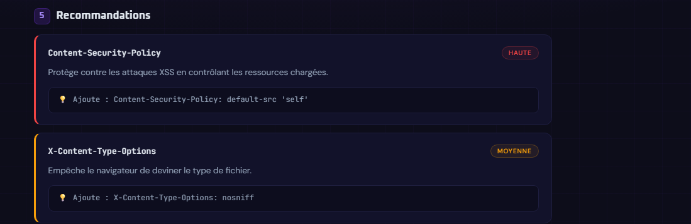

# SecureCheck

Outil d'audit de sécurité web — analyse SSL, headers HTTP et recommandations concrètes.

---

<table>
  <tr>
    <td align="center">
      <br/>
      <sub>Interface principale</sub>
    </td>
    <td align="center">
      <br/>
      <sub>Recommandations détaillées</sub>
    </td>
  </tr>
</table>

---

## Fonctionnalités

SecureCheck vérifie la présence des headers de sécurité HTTP essentiels — `Content-Security-Policy`, `Strict-Transport-Security`, `X-Frame-Options`, `X-Content-Type-Options`, `Referrer-Policy` et `Permissions-Policy` — et calcule un score sur 100. Il récupère également les informations du certificat SSL du domaine analysé : grade (A, B, C…), date d'expiration et nombre de jours restants. L'ensemble est synthétisé dans un score global de sécurité, complété par une liste de recommandations priorisées (haute, moyenne, faible) incluant une description du risque et une correction prête à l'emploi.

---

## Stack

| Couche   | Technologie                    |
|----------|--------------------------------|
| Frontend | React 19, Vite                 |
| Backend  | Node.js, Express 5             |
| SSL      | ssl-checker                    |
| HTTP     | Axios                          |

---

## Lancer en local

**Prérequis :** Node.js >= 18

```bash
# Serveur (port 5000)
cd server
npm install
npm run dev

# Client (port 5173)
cd client
npm install
npm run dev
```

Ouvrir [http://localhost:5173](http://localhost:5173) dans le navigateur.

---

## Auteur

Kimy LAOU — [LinkedIn](https://www.linkedin.com/in/kimy-laou/) · [GitHub](https://github.com/Kimiko4)
